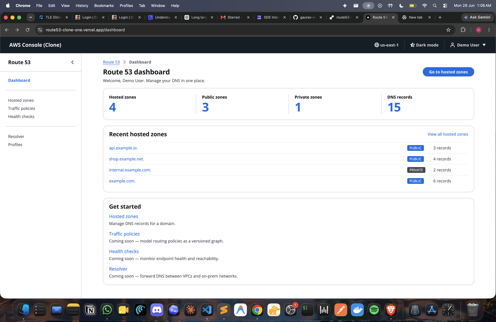
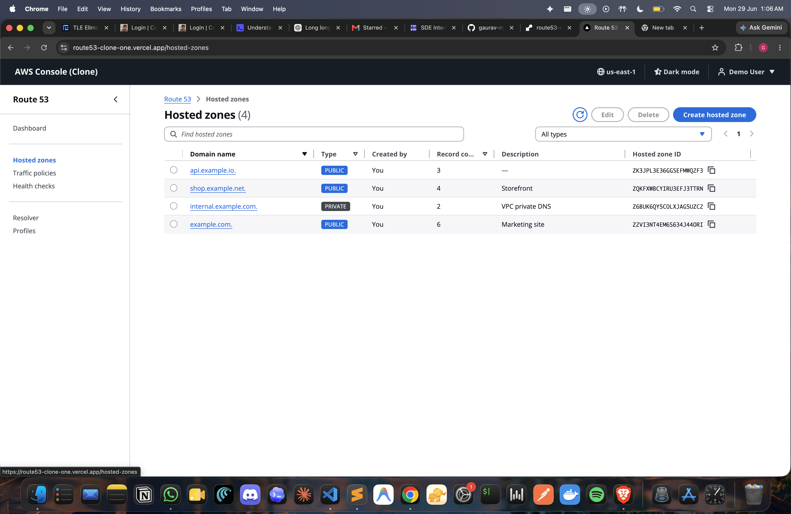
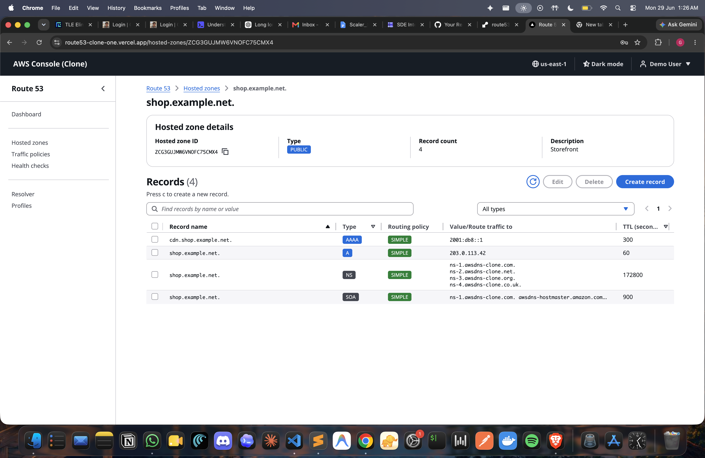

# Route 53 Clone

A high-fidelity clone of the **AWS Route 53 console** built to feel like the
real product, not a generic CRUD app. DNS doesn't actually resolve — the goal
is faithful recreation of the UX, workflows, and information architecture
over real persistence.

- **Frontend** — Next.js 16 (App Router, React 19, TypeScript strict) + AWS
  **Cloudscape Design System** + TanStack Query + zod.
- **Backend** — FastAPI + SQLAlchemy 2.x + Pydantic v2 + SQLite.
- **Strictness** — every file under ~150 LOC; ruff + black + mypy `--strict`
  on Python; ESLint + Prettier + tsc strict on TypeScript; pytests for the
  whole backend surface.

> **Demo login:** `demo@example.com` / `demo1234`
> **Backend:** <http://localhost:8000> (API + `/docs` for the OpenAPI UI)
> **Frontend:** <http://localhost:3000>

## Screenshots

**Dashboard** — live KPI tiles, 7-day activity sparkline, recent zones, quick links.



**Hosted zones** — dense Cloudscape table with the exact Route 53 column set, search, type filter, multi-select for bulk delete, sortable headers.



**Records inside a zone** — zone metadata header, then a records table with Route 53's column set (Record name / Type / Routing policy / Value / TTL). Auto-created NS + SOA shown alongside user records; multi-select for bulk delete; `c` shortcut hint inline; per-type colored badges.



---

## 1. Run it locally

### Backend

```bash
cd backend
python3 -m venv .venv
.venv/bin/pip install -e ".[dev]"
.venv/bin/uvicorn app.main:app --reload --port 8000
```

The first boot auto-seeds the demo user + zones + records (idempotent — gated
on whether the demo user exists). If you want to seed manually for any reason:
`.venv/bin/python -m app.seed`.

### Frontend (in a second terminal)

```bash
cd frontend
npm install
npm run dev                                        # http://localhost:3000
```

Open the frontend, log in with the demo credentials, and the seeded data
appears immediately.

### Run the tests

```bash
cd backend  && .venv/bin/pytest tests/ -q     # 28 backend tests
cd frontend && npm test                       # 17 frontend tests (vitest)
cd frontend && npm run typecheck && npm run lint && npm run build
```

### Environment

Backend reads `DATABASE_URL`, `SESSION_TTL_SECONDS`, `CORS_ORIGINS`,
`CORS_ORIGIN_REGEX`, and the demo-credential triple from env (or
`backend/.env`). All have sensible defaults — locally you typically need
to change nothing. The `CORS_ORIGIN_REGEX` defaults to
`^https://.*\.vercel\.app$`, which makes every Vercel preview deploy work
against a Render-hosted backend without re-listing each URL.

See `backend/.env.example` for the full annotated list.

Frontend reads `NEXT_PUBLIC_API_BASE_URL` (default `http://localhost:8000`).
See `frontend/.env.example`.

---

## 2. Repository layout

```text
backend/
  app/
    main.py              FastAPI factory + lifespan + exception handlers + routers
    core/
      config.py          pydantic-settings (env-driven)
      database.py        SQLAlchemy engine, SessionLocal, Base, TimestampMixin
      dependencies.py    Annotated FastAPI deps (CurrentUser, DbSession, BearerToken)
      exceptions.py      AppError hierarchy + handlers (error envelope)
      ids.py             Route 53-style ID generators (Z…, R…)
      security.py        bcrypt + opaque session tokens
    models/              ORM tables (User, UserSession, HostedZone, DnsRecord)
    schemas/             Pydantic request/response — Create/Update/Read split
    repositories/        Sole DB-access layer (sessions, ilike search, paged list)
    services/            Business logic — auth, hosted-zone, dns-record,
                         zone-bootstrap (auto NS+SOA), stats
    validators/          Per-record-type value rules + apex/ttl/in-zone rules
    routers/             Thin HTTP layer; one file per resource
    seed.py              Demo user + zones + records (idempotent)
  tests/                 pytest — auth, hosted zones, records, validators, stats

frontend/
  app/
    layout.tsx                       Root: Cloudscape global styles + providers
    login/page.tsx
    (console)/
      layout.tsx                     Auth gate + AppShell
      dashboard/page.tsx
      hosted-zones/page.tsx
      hosted-zones/[zoneId]/page.tsx
      {traffic-policies,health-checks,resolver,profiles}/page.tsx
  components/
    shell/                           AppLayout, top nav, side nav, breadcrumbs
    ui/                              Reusable kit: DataTable, ResourceForm,
                                     ConfirmDeleteModal, PageHeader, EmptyState,
                                     SearchFilter
  features/                          Domain code grouped by resource:
    auth/  dashboard/  coming-soon/  hosted-zones/  records/
  providers/                         QueryClient, Auth, Notifications, Theme,
                                     Breadcrumb context
  hooks/                             TanStack Query hooks per resource
  lib/
    api/                             apiFetch + per-resource modules
    types/                           Shared types mirroring backend schemas
    validation/                      zod schemas for forms
    auth/                            Token persistence (localStorage)
```

---

## 3. Architecture

Strict one-directional layering on both sides. Nothing skips layers.

### Frontend (Next.js · Cloudscape · TanStack Query)

```text
app/(console)/<route>/page.tsx        ── routing, ContentLayout, ZoneHeader
            │
            ▼
features/<resource>/table.tsx         ── page-orchestrator (page/sort/filter
            │                            state + modal lifecycle)
            ▼
features/<resource>/{create,edit,     ── modals: zod-validated forms,
                    delete}-modal.tsx    notifications, API error surfacing
            │
            ▼
hooks/use-<resource>.ts               ── TanStack Query: list + detail
hooks/use-<resource>-mutations.ts        create / update / delete
            │                            (optimistic delete, query invalidation)
            ▼
lib/api/<resource>.ts                 ── typed per-resource request fns
            │
            ▼
lib/api/client.ts                     ── ONLY fetch call site; adds auth,
            │                            decodes error envelope -> ApiError
            ▼
                            ── HTTP / JSON ──►   Backend
```

### Backend (FastAPI · SQLAlchemy 2.x · Pydantic v2 · SQLite)

```text
routers/<resource>.py                 ── HTTP layer: parse, dispatch,
            │                            shape response (thin)
            ▼
services/<resource>.py                ── business logic, validation,
            │                            commits, ownership scoping
            ▼
repositories/<resource>.py            ── sole DB-access layer
            │                            (sessions, ilike search, paged list)
            ▼
models/<resource>.py                  ── SQLAlchemy 2.x ORM (Mapped[...])

                              · siblings shared across layers ·
schemas/<resource>.py                 ── Pydantic request/response shapes
validators/{ip,hostname,structured,   ── per-record-type value rules +
            registry}.py                 apex / TTL / in-zone enforcement
core/{config, database, dependencies, ── settings, engine, FastAPI deps,
      exceptions, ids, security}        error envelope, ID gen, bcrypt
```

### Rules

**Backend rules:**

- Only `repositories/` touches the SQLAlchemy session.
- Services own commits, business invariants, and per-type validation.
- Routers parse input, call the service, shape the response — nothing more.
- Every error becomes one envelope:
  `{"error": {"code": "...", "message": "...", "details": [...]}}`.

**Frontend rules:**

- Only `lib/api/client.ts` calls `fetch`. Every resource has its own
  `lib/api/<resource>.ts` of typed request functions on top.
- Server state lives in TanStack Query. Pages own page/sort/filter state.
- Cloudscape components are client-only — pages and shell are `'use client'`,
  loaded under the root server layout.
- The hosted-zones and records pages render the **same** `<DataTable<T>>`
  with different `columnDefinitions` (per spec).

---

## 4. Database schema

SQLite, bootstrapped via `Base.metadata.create_all()` (no Alembic — see
DECISIONS).

```text
users ────┬─< user_sessions          (bearer-token sessions, expire_at)
          │
          └─< hosted_zones ──────────< dns_records
              (Route 53-style id)     (cascade delete on zone)
```

| Table | Columns | Notes |
|---|---|---|
| `users` | `id`, `email` (unique), `password_hash`, `display_name`, timestamps | bcrypt-hashed (pinned `bcrypt<4.0` — see DECISIONS) |
| `user_sessions` | `id`, `user_id` (FK cascade), `token` (unique), `expires_at`, timestamps | opaque random 32-byte URL-safe token |
| `hosted_zones` | `id` (`Z` + 20 base32), `name`, `type` (PUBLIC/PRIVATE), `comment`, `record_count`, `created_by` (FK cascade), timestamps | unique `(created_by, name, type)` |
| `dns_records` | `id` (`R` + 20 base32), `hosted_zone_id` (FK cascade), `name`, `type`, `ttl`, `value`, `routing_policy`, timestamps | indexed on `(hosted_zone_id, name, type)`; per-zone uniqueness enforced in the service to keep the door open for non-SIMPLE policies later |

`record_count` on `hosted_zones` is maintained by the records service —
incremented on create, decremented (clamped at 0) on delete. The dashboard
uses `/api/stats` (a single `SUM` query) instead of paging through zones.

---

## 5. API overview

All routes are JSON. Authenticated routes require `Authorization: Bearer <token>`.
Pagination params: `page` (≥1), `page_size` (1–200), `search`, `type`, `sort`
(`field:asc|desc`).

| Method | Path | Auth | Body / Notes |
|---|---|---|---|
| POST | `/api/auth/login` | – | `{email, password}` → `{token, user}` |
| POST | `/api/auth/logout` | bearer | 204 |
| GET | `/api/auth/me` | bearer | current user |
| GET | `/api/hosted-zones` | bearer | paged list with search/type/sort |
| POST | `/api/hosted-zones` | bearer | `{name, type, comment}` — auto-creates apex NS + SOA |
| GET | `/api/hosted-zones/{zoneId}` | bearer | single zone |
| PATCH | `/api/hosted-zones/{zoneId}` | bearer | `{comment}` (Route 53 doesn't allow renaming a zone) |
| DELETE | `/api/hosted-zones/{zoneId}` | bearer | cascades records |
| GET | `/api/hosted-zones/{zoneId}/records` | bearer | paged list with search/type/sort |
| POST | `/api/hosted-zones/{zoneId}/records` | bearer | `{name, type, ttl, value, routing_policy?}` — value validated per type |
| GET | `/api/records/{recordId}` | bearer | ownership-scoped (404 if not yours) |
| PATCH | `/api/records/{recordId}` | bearer | `{ttl?, value?}` — only changed fields |
| DELETE | `/api/records/{recordId}` | bearer | ownership-scoped |
| GET | `/api/stats` | bearer | dashboard totals (zones, public, private, records) |
| GET | `/api/stats/activity?days=N` | bearer | records-created per day, last N days (1–90) |
| GET | `/api/health` | – | liveness |

Full live spec at <http://localhost:8000/docs>.

**Error envelope (every non-2xx):**

```json
{"error": {"code": "validation_failed", "message": "value: '999.0.0.1' is not a valid IPv4 address.", "details": []}}
```

`details` is populated for Pydantic request-validation errors with `{field, message, type}`.

---

## 6. Per-record-type validation

Encoded once on the backend (`backend/app/validators/`) and surfaced as
backend errors in the create/edit forms (frontend zod does shape-level
checks only — backend is authoritative):

- **A** — valid IPv4
- **AAAA** — valid IPv6 (returned in compressed form)
- **CNAME** — single hostname; not allowed at zone apex
- **TXT** — quoted strings, each ≤255 chars, canonicalized with escapes
- **MX** — `priority hostname`, priority 0–65535, multi-line allowed
- **NS** — one or more hostnames, one per line
- **PTR** — hostname
- **SRV** — `priority weight port target`, port 1–65535
- **CAA** — `flags tag value`, tag ∈ `issue|issuewild|iodef`
- **TTL** — int in `0..604800` (1 week)
- **Record name** — normalised to lowercase + trailing dot, must fall in
  the zone; bare `www` is interpreted as `www.example.com.` (Route 53
  console behaviour); `@` is the apex.

---

## 7. What's mocked

- **Auth** — opaque bearer-token sessions in the DB. No JWT, no refresh,
  no password reset. Single demo user out of the box.
- **DNS resolution** — none. Records are stored and rendered, not served.
- **NS/SOA nameservers** — auto-created at zone creation with placeholder
  values (`ns-1.awsdns-clone.com.` …). The shape is right; the names are
  cosmetic.
- **Service sections** — Dashboard is real: KPI tiles from `/api/stats`,
  a 7-day "records created" sparkline from `/api/stats/activity` (sourced
  from actual `dns_records.created_at` timestamps), and a recent-zones
  list. Traffic policies / Health checks / Resolver / Profiles render a
  polished "Coming soon" page with the real Route 53-style description
  of what each section does.
- **Region/account** — the top nav shows a static `us-east-1` chip.

---

## 8. Bonus features

Of the five bonus items in the spec:

- ✅ **Dark mode** — Cloudscape `applyMode` toggle in the top nav,
  persisted to `localStorage`.
- ✅ **Bulk operations** — multi-select on both the hosted-zones and
  records tables, with a typed-confirmation bulk delete modal that loops
  per-item and surfaces individual failures.
- ✅ **Keyboard shortcuts** — `c` opens the create modal on the hosted-
  zones and records pages (suppressed while typing in inputs).
- ❌ **Import / export BIND zone files** — skipped; parser work would
  have compromised the core slice.

---

## 9. Testing

- **Backend — 28 pytests.** Auth happy/error paths + envelope shape,
  hosted-zones CRUD + pagination/search/filter/sort + 409 on dup + 422
  on bad domain + 401 unauthenticated, records CRUD + auto NS/SOA on zone
  create + dup → 409 + three validation error paths + paginate/search/filter,
  per-type validators (11 cases incl. apex CNAME ban and TTL bounds),
  `/api/stats` sums, and `/api/stats/activity` daily buckets.
- **Frontend — 17 vitest tests.** `ApiError` envelope handling, zod
  schemas for both create forms, `EmptyState` rendering, `useKeyboardShortcut`
  hook behaviour (fires / ignores non-matching / respects `enabled` /
  skips while typing). `tsc --noEmit` (strict + `noUncheckedIndexedAccess`),
  ESLint, and `next build` are the gate; CI runs all of it on every push.

---

## 10. Continuous integration

`.github/workflows/ci.yml` runs on every push and PR to `main`:

- **Backend job** — `ruff check`, `mypy app/`, `pytest tests/ -q`.
- **Frontend job** — `npm ci`, `npm run typecheck`, `npm run lint`,
  `npm run build`, `npm test`.

---

## 11. Decisions log

Architectural decisions and trade-offs are recorded in
[`DECISIONS.md`](./DECISIONS.md).
